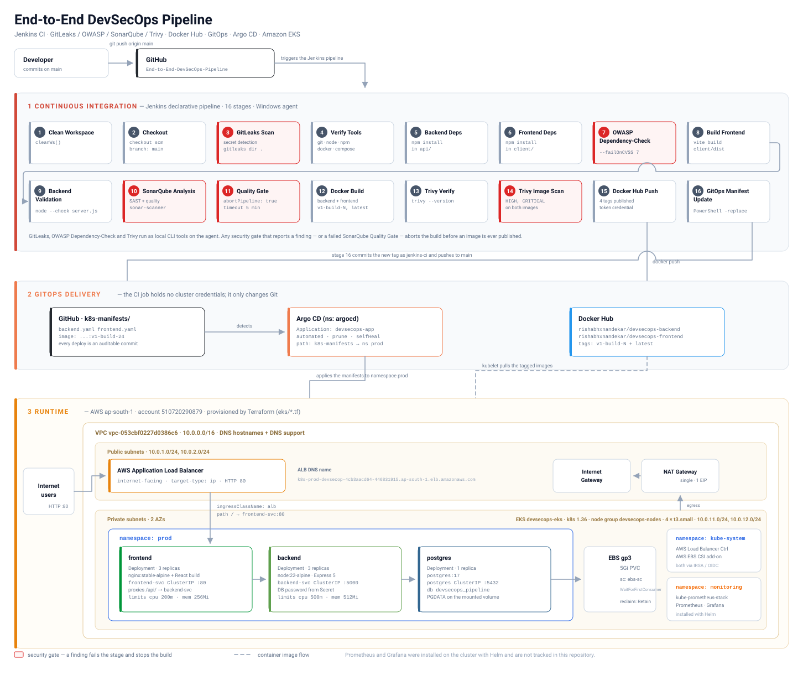

# End-to-End DevSecOps Pipeline


A complete DevSecOps pipeline for a 3-tier task-manager application. A push to `main` runs a
16-stage Jenkins pipeline with four independent security gates — secret detection (GitLeaks),
dependency CVE analysis (OWASP Dependency-Check), static analysis and a Quality Gate (SonarQube),
and container image scanning (Trivy) — then builds and publishes Docker images, updates the
Kubernetes manifests in Git, and lets **Argo CD** roll the change out to an **Amazon EKS** cluster
that is provisioned end to end with **Terraform**.

The CI job holds no cluster credentials. It changes Git; Argo CD changes the cluster.

---

## Architecture



---

## Table of Contents

- [Architecture](#architecture)
- [What actually runs in production](#what-actually-runs-in-production)
- [How it works — one developer push](#how-it-works--one-developer-push)
- [CI pipeline stages](#ci-pipeline-stages)
- [Security gates](#security-gates)
- [GitOps continuous delivery](#gitops-continuous-delivery)
- [AWS infrastructure (Terraform)](#aws-infrastructure-terraform)
- [Kubernetes manifests](#kubernetes-manifests)
- [Request path](#request-path)
- [Application](#application)
- [Docker setup](#docker-setup)
- [Local development](#local-development)
- [Reproducing this environment](#reproducing-this-environment)
- [Monitoring](#monitoring)
- [Project structure](#project-structure)
- [Design decisions and known limitations](#design-decisions-and-known-limitations)
- [Tools and technologies](#tools-and-technologies)

---

## What actually runs in production

Every value below is taken from the deployed environment, not from a template.

| | |
| --- | --- |
| AWS region | `ap-south-1` |
| AWS account | `510720290879` |
| EKS cluster | `devsecops-eks` |
| Kubernetes version | `v1.36.3-eks-cb19647` |
| VPC | `vpc-053cbf0227d0386c6` — `10.0.0.0/16` |
| Public subnets | `10.0.1.0/24`, `10.0.2.0/24` (2 AZs) |
| Private subnets | `10.0.11.0/24`, `10.0.12.0/24` (2 AZs) |
| Node group | `devsecops-nodes` — 4 × `t3.small`, `ON_DEMAND`, min 4 / desired 4 / max 4 |
| Worker nodes | `ip-10-0-11-21`, `ip-10-0-11-78`, `ip-10-0-12-60`, `ip-10-0-12-66` |
| Application namespace | `prod` — frontend ×3, backend ×3, postgres ×1 |
| Argo CD namespace | `argocd` |
| Monitoring namespace | `monitoring` |
| Ingress | AWS ALB, `internet-facing`, `target-type: ip`, listener HTTP `80` |
| ALB DNS | `k8s-prod-devsecop-4cb3aacd64-446831915.ap-south-1.elb.amazonaws.com` |
| Storage | `ebs-sc` → AWS EBS CSI, `gp3`, 5 Gi PVC, `Retain`, `WaitForFirstConsumer` |
| ALB controller IAM role | `devsecops-alb-controller-role` (IRSA) |
| OIDC provider id | `BCF1E29D8F3871943966C6CF61281969` |
| Container images | `rishabhxnandekar/devsecops-backend`, `rishabhxnandekar/devsecops-frontend` |

**Verified end-to-end run** — Jenkins build **#24** passed every gate, published
`v1-build-24` for both images, and pushed the manifest update as commit
[`a792381`](https://github.com/rishabhxnandekar21/End-to-End-DevSecOps-Pipeline/commit/a792381bd883ae9d57da0654935939fcaa9852d7),
which Argo CD then synced to the `prod` namespace automatically.

---

## How it works — one developer push

A developer fixes a bug in the task API. From commit to running pods:

**1 · Push** — the commit lands on `main` and Jenkins starts. The workspace is wiped
(`cleanWs()`) so nothing carries over from the previous build.

**2 · Secret scan** — GitLeaks scans the checked-out tree before anything else runs. A committed
token fails the build here, before the code is ever installed or built.

**3 · Dependencies** — `npm install` runs in `api/` and `client/`, then OWASP Dependency-Check
scans the resolved tree and **fails the build on any CVE scoring CVSS ≥ 7**.

**4 · Build and validate** — Vite builds the React app into `client/dist`, and
`node --check server.js` validates the backend entry point.

**5 · Static analysis** — sonar-scanner submits `api/` and `client/` to SonarQube, and the
pipeline blocks on `waitForQualityGate abortPipeline: true`. A failed Quality Gate stops the build.

**6 · Image build** — Docker builds both images and tags each one twice:
`v1-build-<BUILD_NUMBER>` and `latest`.

**7 · Image scan** — Trivy scans **both freshly built images** for `HIGH` and `CRITICAL`
vulnerabilities. This happens *before* the push, so a failing image never reaches the registry.

**8 · Publish** — all four tags are pushed to Docker Hub using a scoped Docker Hub access token
injected from the Jenkins credential store.

**9 · GitOps update** — Jenkins rewrites the image tag inside `k8s-manifests/backend.yaml` and
`k8s-manifests/frontend.yaml`, commits as `jenkins-ci`, and pushes to `main`. If the tags are
already current the stage exits cleanly instead of creating an empty commit.

**10 · Argo CD syncs** — Argo CD watches `k8s-manifests/` and applies the change to the `prod`
namespace. Deployments roll: new pods start on the new tag, old pods drain.

**11 · Live** — the ALB serves the new frontend. `selfHeal` and `prune` keep the cluster matching
Git from that point on.

> The developer does one thing: push. Everything from the secret scan to the rolling update is automatic.

---

## CI pipeline stages

The pipeline is defined in [`Jenkinsfile`](Jenkinsfile) and runs **16 stages** on a Windows agent
(`bat` steps, `skipDefaultCheckout`, `timestamps`).

| # | Stage | Tool | What it does |
| --- | --- | --- | --- |
| 1 | Clean Workspace | Jenkins | `cleanWs()` — every build starts from an empty workspace |
| 2 | Checkout | Git | `checkout scm` on `main` |
| 3 | **GitLeaks Scan** | GitLeaks | `gitleaks dir . --verbose` — secret detection across the repo |
| 4 | Verify Tools | — | Asserts `git`, `node`, `npm`, `docker`, `docker compose` on the agent |
| 5 | Backend Dependencies | npm | `npm install` in `api/` |
| 6 | Frontend Dependencies | npm | `npm install` in `client/` |
| 7 | **OWASP Dependency-Check** | Dependency-Check | HTML report, `--disableYarnAudit`, `--failOnCVSS 7` |
| 8 | Build Frontend | Vite | `npm run build` → `client/dist` |
| 9 | Backend Validation | Node.js | `node --check server.js` |
| 10 | **SonarQube Analysis** | sonar-scanner | SAST and code quality via `withSonarQubeEnv` |
| 11 | **Quality Gate** | SonarQube | `waitForQualityGate abortPipeline: true`, 5-minute timeout |
| 12 | Docker Build | Docker | Builds both images, tags `v1-build-N` and `latest` |
| 13 | Trivy Verify | Trivy | Confirms the scanner is present before relying on it |
| 14 | **Trivy Image Scan** | Trivy | `--severity HIGH,CRITICAL` on both built images |
| 15 | Docker Hub Push | Docker | Pushes all four tags with a token-based `config.json` |
| 16 | GitOps Manifest Update | Git | Rewrites image tags, commits as `jenkins-ci`, pushes to `main` |

**Post-build:** `client/dist/**` is archived and fingerprinted on success, and the
Dependency-Check HTML report is archived on every run (`allowEmptyArchive: true`) so a failed
build still leaves its evidence behind.

### Image tagging

Each build publishes four tags:

| Image | Tags |
| --- | --- |
| `rishabhxnandekar/devsecops-backend` | `v1-build-<BUILD_NUMBER>`, `latest` |
| `rishabhxnandekar/devsecops-frontend` | `v1-build-<BUILD_NUMBER>`, `latest` |

`v1-build-N` is immutable and is what the Kubernetes manifests pin, so any running pod can be
traced back to the exact Jenkins build that produced it. `latest` exists for convenience only and
is never referenced by a manifest.

### Jenkins configuration this pipeline expects

| Item | Kind | Used for |
| --- | --- | --- |
| `sonarqube-token` | Secret text | sonar-scanner authentication |
| `dockerhub-test-new` | Username / password | Docker Hub access token |
| `github-push` | Username / password | HTTPS push of the GitOps commit |
| `SonarScanner` | Global tool | Provides `sonar-scanner.bat` |
| `SonarQube` | SonarQube server | Server config for `withSonarQubeEnv` |

Agent-side tooling is referenced through the `environment` block: `GITLEAKS`,
`DEPENDENCY_CHECK` and `TRIVY` point at CLI binaries under `C:\Tools`, and `JAVA_HOME` pins
Temurin JDK 21 for Dependency-Check and sonar-scanner.

---

## Security gates

Four independent gates, each catching a different class of problem, each able to stop the build.

| Gate | Stage | Catches | Failure behaviour |
| --- | --- | --- | --- |
| **GitLeaks** | 3 | Committed secrets, tokens, keys | Non-zero exit fails the stage |
| **OWASP Dependency-Check** | 7 | Known CVEs in npm dependencies | Fails on CVSS ≥ 7 |
| **SonarQube + Quality Gate** | 10–11 | Bugs, code smells, security hotspots, duplication | `abortPipeline: true` |
| **Trivy** | 14 | OS and library CVEs inside the built images | Scans both images before push |

Two properties matter more than the tool list:

- **The secret scan runs first.** It costs seconds, and a leaked credential is the one finding
  that is worse the longer it takes to detect.
- **The image scan runs before the push, not after.** A vulnerable image is caught while it still
  only exists on the build agent, so it never becomes something a cluster could pull.

---

## GitOps continuous delivery

The CI job has no kubeconfig, no cluster role, and no `kubectl`. It changes one thing — the image
tag in Git:

```
powershell -NoProfile -Command
  "(Get-Content 'k8s-manifests\backend.yaml')
     -replace 'devsecops-backend:v1-build-[0-9]+', 'devsecops-backend:v1-build-%BUILD_NUMBER%'
     | Set-Content 'k8s-manifests\backend.yaml'"
```

It then commits as `jenkins-ci` and pushes over HTTPS using the `github-push` credential.
`git diff --cached --quiet` guards the commit, so a rebuild that produces no manifest change
exits the stage cleanly rather than pushing an empty commit.

Argo CD picks it up from there — [`gitops/devsecops-app.yaml`](gitops/devsecops-app.yaml):

| Field | Value |
| --- | --- |
| Application | `devsecops-app` in namespace `argocd` |
| Source | this repository, `targetRevision: main`, `path: k8s-manifests` |
| Destination | in-cluster, namespace `prod` |
| Sync policy | `automated`, `prune: true`, `selfHeal: true`, `CreateNamespace=true` |

What this buys:

- **Audit trail** — every deployment is a commit, with a build number in the message.
- **Rollback** — `git revert` the manifest commit and Argo CD rolls the cluster back.
- **Drift correction** — `selfHeal` reverts anything changed by hand in the cluster.
- **Blast radius** — a compromised CI agent can open a pull request's worth of damage, not a
  cluster's worth.

---

## AWS infrastructure (Terraform)

Everything under [`eks/`](eks) is applied with Terraform against the `terraform-admin` AWS
profile in `ap-south-1`. The configuration is intentionally flat and readable rather than wrapped
in modules — the whole cluster is four files.

```
eks/
├── main.tf                 # VPC, subnets, IGW, NAT, routes, EKS, node group, OIDC, EBS CSI, Argo CD
├── alb-controller.tf       # ALB controller IAM policy + IRSA role + Helm release + CRD read RBAC
├── variables.tf            # region, cluster name, k8s version, instance type, scaling
├── provider.tf             # aws / tls / helm / kubernetes providers wired to the new cluster
└── policies/
    └── aws-load-balancer-controller-policy.json
```

### Network

| Resource | Details |
| --- | --- |
| VPC | `10.0.0.0/16`, DNS hostnames and DNS support enabled |
| Public subnets | 2 × `/24` across 2 AZs, `map_public_ip_on_launch`, tagged `kubernetes.io/role/elb = 1` |
| Private subnets | 2 × `/24` across 2 AZs, tagged `kubernetes.io/role/internal-elb = 1` — all worker nodes live here |
| Internet Gateway | Attached to the VPC, default route for the public route table |
| NAT Gateway | One NAT with one Elastic IP in a public subnet |
| Route tables | One public (→ IGW); one private route table per AZ (→ NAT) |

The subnet tags are what let the AWS Load Balancer Controller discover where to place an ALB —
without them, ingress provisioning silently fails.

### Cluster and nodes

| Resource | Details |
| --- | --- |
| EKS cluster | `devsecops-eks`, Kubernetes `1.36`, control plane attached to the private subnets |
| API endpoint | Private and public access both enabled |
| Cluster IAM role | `AmazonEKSClusterPolicy` |
| Node IAM role | `AmazonEKSWorkerNodePolicy`, `AmazonEKS_CNI_Policy`, `AmazonEC2ContainerRegistryReadOnly` |
| Managed node group | `devsecops-nodes` — `t3.small`, `ON_DEMAND`, min 4 / desired 4 / max 4, private subnets |

### Identity and add-ons

| Component | How it is created | Purpose |
| --- | --- | --- |
| OIDC provider | `aws_iam_openid_connect_provider` with the cluster's TLS thumbprint | Foundation for IRSA |
| EBS CSI driver | `aws_eks_addon` + dedicated IRSA role trusting `kube-system:ebs-csi-controller-sa` | Dynamic `gp3` volume provisioning |
| AWS Load Balancer Controller | IAM policy from JSON + IRSA role trusting `kube-system:aws-load-balancer-controller` + Helm release | Turns the Ingress into a real ALB |
| ALB controller CRD access | Extra `ClusterRole` / `ClusterRoleBinding` for `customresourcedefinitions` | The chart needs to read its own CRDs at startup |
| Argo CD | `helm_release` into namespace `argocd` | GitOps controller |

Both service accounts authenticate with **IRSA** — an IAM role assumed through the cluster's OIDC
provider and scoped by a `sub` condition to one namespace and one service account name. No static
AWS keys exist anywhere in the cluster.

---

## Kubernetes manifests

Everything in [`k8s-manifests/`](k8s-manifests) is what Argo CD applies.

| Manifest | Kinds | Details |
| --- | --- | --- |
| `namespace.yaml` | Namespace | `prod` |
| `sc.yaml` | StorageClass | `ebs-sc` — `ebs.csi.aws.com`, `gp3`, `ext4`, `Retain`, `WaitForFirstConsumer` |
| `postgres.yaml` | Service + Deployment + PVC | `postgres:17`, 1 replica, 5 Gi PVC, `PGDATA=/var/lib/postgresql/data/pgdata`, ClusterIP `:5432` |
| `backend.yaml` | Deployment + Service | 3 replicas, ClusterIP `:5000`, requests 100m/128Mi, limits 500m/512Mi |
| `frontend.yaml` | Deployment + Service | 3 replicas, ClusterIP `:80`, requests 100m/128Mi, limits 200m/256Mi |
| `ingress.yaml` | Ingress | `ingressClassName: alb`, `internet-facing`, `target-type: ip`, HTTP `80` → `frontend-svc:80` |

`WaitForFirstConsumer` matters on a multi-AZ cluster: it delays EBS volume creation until the
scheduler has chosen a node, so the volume is created in an AZ the pod can actually reach.
`Retain` means deleting the PVC does not delete the database.

### One thing the repository deliberately does not contain

The backend and postgres pods both read the database password from a Secret named
`postgres-secret`. **That Secret is not committed.** It is created out of band:

```bash
kubectl create secret generic postgres-secret -n prod --from-literal=password='<your-password>'
```

Argo CD will not manage or prune it, and a plaintext password never enters Git.

---

## Request path

```
Internet
  │  HTTP :80
  ▼
AWS ALB  (internet-facing, IP targets, provisioned by the AWS Load Balancer Controller)
  │  path /
  ▼
frontend-svc:80  →  nginx (3 pods)
  │
  ├── /            → serves the React SPA, try_files $uri /index.html
  └── /api/        → proxy_pass http://backend-svc:5000/api/
                        │
                        ▼
                   backend-svc:5000  →  Express (3 pods)
                        │
                        ▼
                   postgres:5432  →  PostgreSQL 17  →  5 Gi EBS gp3
```

Worth being explicit about: **the ALB has exactly one rule.** It sends `/` to the frontend and
nothing else. API traffic is not routed at the ingress at all — the nginx container in front of
the React build reverse-proxies `/api/` to `backend-svc:5000` inside the cluster. The backend is
never exposed to the internet, and the browser only ever talks to one origin, so there is no CORS
preflight in the request path.

---

## Application

A 3-tier task manager. Deliberately small, so the pipeline is the subject and not the app.

| Tier | Stack | Runtime image |
| --- | --- | --- |
| Frontend | React 19, Vite 8, Axios, react-icons | `nginx:stable-alpine` serving the built SPA |
| Backend | Node.js 22, Express 5, `pg` | `node:22-alpine` |
| Database | PostgreSQL 17 | `postgres:17` |

### API

| Method | Route | Purpose |
| --- | --- | --- |
| `GET` | `/` | Health check |
| `GET` | `/api/todos/test` | Route liveness check |
| `GET` | `/api/todos` | List all tasks, newest first |
| `POST` | `/api/todos` | Create a task (`title` required; status defaults to `Pending`) |
| `PUT` | `/api/todos/:id` | Update title, description and status |
| `DELETE` | `/api/todos/:id` | Delete a task |

Every query is parameterised (`$1`, `$2`, …) through `pg`, so user input is never concatenated
into SQL.

### Startup resilience

`api/config/database.js` does not assume the database is ready. It retries `SELECT NOW()` up to
ten times at five-second intervals before exiting non-zero:

```js
const connectWithRetry = async (retries = 10) => {
  while (retries > 0) {
    try { await pool.query("SELECT NOW()"); return; }
    catch (error) { retries--; await new Promise(r => setTimeout(r, 5000)); }
  }
  process.exit(1);
};
```

This is what makes the backend survive a cold cluster. Kubernetes starts all three Deployments in
parallel — a backend that exited on first connection failure would CrashLoopBackOff until
PostgreSQL finished initialising its data directory. Instead it waits, connects, and serves.

---

## Docker setup

**Frontend** — multi-stage, so Node and the npm tree never ship to production:

```dockerfile
FROM node:22-alpine AS react-builder
WORKDIR /app
COPY package*.json ./
RUN npm install
COPY . .
RUN npm run build

FROM nginx:stable-alpine
COPY nginx.conf /etc/nginx/conf.d/default.conf
COPY --from=react-builder /app/dist /usr/share/nginx/html
EXPOSE 80
```

The runtime image is nginx plus static files. No Node.js runtime, no `node_modules`, and a much
smaller surface for Trivy to find anything in.

**Backend:**

```dockerfile
FROM node:22-alpine
RUN npm install -g npm@10.9.9
WORKDIR /app
COPY package*.json ./
RUN npm install
COPY . .
EXPOSE 5000
CMD ["npm","start"]
```

Both builds honour a `.dockerignore` that keeps `node_modules`, `.env` and build output out of
the build context.

---

## Local development

[`docker-compose.yml`](docker-compose.yml) brings the whole stack up locally:

| Service | Image | Port |
| --- | --- | --- |
| `postgres` | `postgres:17` | `5432` |
| `backend` | built from `./api` | `5000` |
| `frontend` | built from `./client` | `80` |

```bash
docker compose up --build
```

PostgreSQL has a `pg_isready` healthcheck and the backend declares
`depends_on: condition: service_healthy`, so the API does not start against a database that has
not finished initialising. Data persists in the `postgres_data` named volume.

The backend reads its configuration from `api/.env` (git-ignored):

```
PORT=5000
DB_HOST=postgres
DB_PORT=5432
DB_USER=postgres
DB_PASSWORD=<your-password>
DB_NAME=devsecops_pipeline
```

The `todos` table is created against that database before first use:

```sql
CREATE TABLE IF NOT EXISTS todos (
  id          SERIAL PRIMARY KEY,
  title       VARCHAR(255) NOT NULL,
  description TEXT,
  status      VARCHAR(50) DEFAULT 'Pending',
  created_at  TIMESTAMP DEFAULT CURRENT_TIMESTAMP,
  updated_at  TIMESTAMP DEFAULT CURRENT_TIMESTAMP
);
```

---

## Reproducing this environment

**1 · Infrastructure**

```bash
cd eks
terraform init
terraform apply
```

This creates the VPC, the EKS cluster, the node group, the OIDC provider, the EBS CSI add-on, the
AWS Load Balancer Controller and Argo CD.

**2 · Cluster access**

```bash
aws eks update-kubeconfig --name devsecops-eks --region ap-south-1
```

**3 · Database credential** (not in Git, see [above](#one-thing-the-repository-deliberately-does-not-contain))

```bash
kubectl create namespace prod
kubectl create secret generic postgres-secret -n prod --from-literal=password='<your-password>'
```

**4 · Hand the cluster to Argo CD**

```bash
kubectl apply -f gitops/devsecops-app.yaml
```

Argo CD applies everything in `k8s-manifests/` and keeps it in sync from then on.

**5 · Find the application**

```bash
kubectl get ingress -n prod
```

**6 · Jenkins** — point a pipeline job at this repository, add the credentials and tools listed
[above](#jenkins-configuration-this-pipeline-expects), and make sure GitLeaks, OWASP
Dependency-Check, Trivy, Docker and a JDK are installed on the agent.

---

## Monitoring

`kube-prometheus-stack` is installed on the cluster with Helm into the `monitoring` namespace.
Validated components: Prometheus, Grafana, Alertmanager, Prometheus Operator, kube-state-metrics
and Node Exporter.

The node group runs **4 × `t3.small`** rather than a smaller count so that the Node Exporter
DaemonSet plus the monitoring control plane fit alongside the application pods. On a smaller node
group the monitoring pods sit `Pending` — not for lack of CPU or memory, but because `t3.small`
caps the number of pods per node via ENI limits.

> The monitoring stack is applied with Helm and is **not** tracked in this repository, so Argo CD
> does not manage it. Moving it under GitOps is on the list below.

---

## Project structure

```
End-to-End-DevSecOps-Pipeline/
├── Jenkinsfile                  # 16-stage DevSecOps pipeline
├── docker-compose.yml           # Local stack: postgres + backend + frontend
├── sonar-project.properties     # SonarQube project key, sources, exclusions
│
├── api/                         # Node.js 22 + Express 5 backend
│   ├── Dockerfile
│   ├── server.js                # Express app, CORS, /api/todos, health check
│   ├── config/database.js       # pg pool + connect-with-retry
│   ├── controllers/             # Todo CRUD controllers
│   ├── models/                  # Parameterised SQL against PostgreSQL
│   └── routes/                  # /api/todos router
│
├── client/                      # React 19 + Vite frontend
│   ├── Dockerfile               # Multi-stage: Vite build → nginx:stable-alpine
│   ├── nginx.conf               # SPA fallback + /api/ reverse proxy to backend-svc:5000
│   └── src/
│       ├── components/          # Navbar, TodoForm, TodoCard, EmptyState
│       ├── pages/Home.jsx       # Task dashboard
│       └── services/api.js      # Axios client, baseURL /api
│
├── eks/                         # Terraform — AWS infrastructure
│   ├── main.tf                  # VPC, EKS, node group, OIDC, EBS CSI, Argo CD
│   ├── alb-controller.tf        # ALB controller IAM + IRSA + Helm release
│   ├── variables.tf
│   ├── provider.tf
│   └── policies/                # AWS Load Balancer Controller IAM policy
│
├── k8s-manifests/               # Synced by Argo CD into namespace prod
│   ├── namespace.yaml
│   ├── sc.yaml                  # StorageClass ebs-sc (gp3)
│   ├── postgres.yaml            # Service + Deployment + 5Gi PVC
│   ├── backend.yaml             # Deployment (3) + ClusterIP Service
│   ├── frontend.yaml            # Deployment (3) + ClusterIP Service
│   └── ingress.yaml             # AWS ALB ingress
│
├── gitops/
│   └── devsecops-app.yaml       # Argo CD Application (automated, prune, selfHeal)
│
└── docs/
    └── architecture.svg         # Architecture diagram
```

---

## Design decisions and known limitations

Choices worth explaining, and the things I would change next.

**Jenkins pushes to the branch it builds.** The GitOps manifests live in this repository rather
than a separate one, so stage 16 commits back to `main`. That commit can re-trigger the job. The
next iteration is either a dedicated manifest repository or a commit-message filter on the SCM
trigger so `jenkins-ci` commits are ignored.

**PostgreSQL is a Deployment, not a StatefulSet.** With a single replica on a `ReadWriteOnce` EBS
volume this works, but a Deployment's default rolling update can try to start a second pod before
the first releases the volume. A StatefulSet — or `strategy: Recreate` — is the correct shape for
a stateful workload.

**The ALB terminates HTTP, not HTTPS.** There is no ACM certificate or cert-manager in the current
setup, so traffic reaches the load balancer on port 80. Adding an ACM certificate and an HTTPS
listener annotation is the smallest meaningful hardening step available.

**Trivy scans images, not the filesystem.** Dependency CVEs are covered by OWASP Dependency-Check,
so the two overlap in intent; a `trivy fs` stage would add defence in depth and produce archived
HTML reports alongside the Dependency-Check output.

**Security findings are reported to the console.** Dependency-Check produces an archived HTML
report, but GitLeaks and Trivy currently fail the build with console output only. Emitting SARIF
or HTML for both would make findings reviewable after the fact instead of only in the build log.

**No automated tests.** Stage 9 checks syntax, not behaviour. The pipeline verifies that the code
parses, builds, and contains no known-vulnerable dependencies — it does not verify that it is
correct. A unit-test stage feeding coverage into the SonarQube Quality Gate is the obvious next
addition.

**Build notifications are console-only.** The `post` block echoes a stage-by-stage summary and
archives artifacts; wiring it to Slack or email is a small change and a real improvement to
feedback time.

---

## Tools and technologies

| Category | Tools |
| --- | --- |
| CI/CD | Jenkins (declarative pipeline), Argo CD |
| Security | GitLeaks, OWASP Dependency-Check, SonarQube (SAST + Quality Gate), Trivy |
| Containers | Docker, multi-stage builds, Docker Hub |
| Orchestration | Kubernetes (EKS 1.36), Helm |
| Infrastructure as Code | Terraform (AWS, TLS, Helm and Kubernetes providers) |
| AWS | VPC, subnets, IGW, NAT Gateway, EKS, EC2, EBS, ALB, IAM, OIDC |
| Kubernetes add-ons | AWS Load Balancer Controller, AWS EBS CSI driver, Argo CD, kube-prometheus-stack |
| Identity | IRSA (IAM Roles for Service Accounts) via the cluster OIDC provider |
| Observability | Prometheus, Grafana, Alertmanager, kube-state-metrics, Node Exporter |
| Application | React 19, Vite 8, Node.js 22, Express 5, PostgreSQL 17, nginx |
